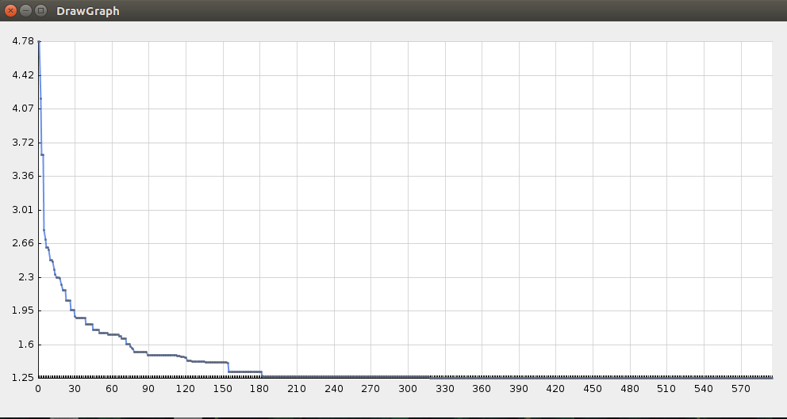

# OptimizationAlgorithmAnalysisGui
## Comparitive study of Optimization Algorithms nature inspired algorithm's benchmark functions for optimization of multi-dimensional chromosome.

This repository contains graph plotting gui which can read _.csv_ generated by different optimizations algorithms and generate graph gui with it.  

__Usage Instructions__  

1. __Fitness Function__ : Hard code the fitness function (_by default Ackley's method coded_) into the FitnessFunction.java file. Tuning variations with dimensions and bounds to the fitness functions can done as per need.  
2. __Tuning Parameters__ : Different parameters like iteration number, population size, cross-over/mutation rate, interia/weight factor, different constants sepcific to algorithms can be varied for better convergance.  
3. __Graph Plot Gui__ : Change the BufferReader string to be read for using different .csv files for plotting work.  

__Sample Screenshot__  

This is sample GUI generated from GraphPloiGui.java with swing library methods.  

  
